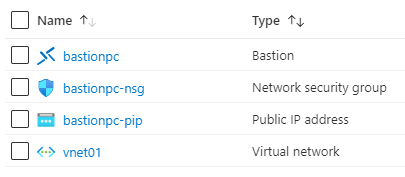

101-azure-bastion-nsg
===
Deploy Azure Bastion in an Azure Virtual Network
---

## Description

This is a conversion of ARM template [101-azure-bastion-nsg](https://github.com/Azure/azure-quickstart-templates/tree/master/101-azure-bastion-nsg) from the repository [azure\azure-quickstart-templates](https://github.com/Azure/azure-quickstart-templates) to PowerShell Script.

This script will deploy Azure Bastion in a new or existing Azure Virtual Network, along with dependent resources such as the AzureBastionSubnet, Public Ip Address for Azure Bastion, and Network Security Group rules, and deploys resources in the same Resource Group and Azure region as the Virtual Network, and it will deploy the following resources...



## Syntax
```
Deploy-AzResources.ps1 -VNetName <string> -BastionHostName <string> -BastionSubnetIPPrefix <string> [-ResourceGroupName <string>] [<CommonParameters>]

Deploy-AzResources.ps1 -ResourceGroupName <string> -Location <string> -VNetName <string> -VNetIPPrefix <string> -DefaultSubnetIPPrefix <string> -BastionHostName <string> -BastionSubnetIPPrefix <string> [<CommonParameters>]

```
## Example
```powershell
I 💙 PS> $param = @{
>> resourceGroupName = 'rgroup01'
>> location = 'westus'
>> VNetName = 'vnet01'
>> VNetIPPrefix = '10.0.0.0/16'
>> DefaultSubnetIPPrefix = '10.0.0.0/24'
>> BastionHostName = 'bastionpc'
>> BastionSubnetIPPrefix = '10.0.1.0/24'
>> }

I 💙 PS> .\Deploy-AzResources.ps1 @param
```

## Output
```
bastionpc is successfully deployed.
```

> Azure Cloud Shell comes with Azure PowerShell pre-installed and you can deploy the above resources using Cloud Shell as well.
>
>[](https://shell.azure.com)

Thank you.
