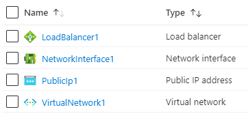

101-loadbalancer-with-nat-rule
===
Load Balancer with Inbound NAT Rule
---

## Description

This is a conversion of ARM template [101-loadbalancer-with-nat-rule](https://github.com/Azure/azure-quickstart-templates/tree/master/101-loadbalancer-with-nat-rule) from the repository [azure\azure-quickstart-templates](https://github.com/Azure/azure-quickstart-templates) to PowerShell Script.

This script allows you to create a Load Balancer, Public IP address for the Load balancer, Virtual Network, Network Interface in the Virtual Network & a NAT Rule in the Load Balancer that is used by the Network Interface, and it will deploy following the resources...



... and in-addition to it, just in-case if the deployment is not successful, then it will rollback the entire deployment.

> ### Note: 
> If there is already the specified resource group exists then the script will not continue with the deployment.

## Syntax
```
Deploy-AzResource.ps1 [-ResourceGroupName] <string> [-Location] <string> [[-AddressPrefix] <string>] [[-SubnetPrefix] <string>] [-DNSNameforLBIP] <string> [[-PublicIPAddressType] <string>] [<CommonParameters>]
```
## Example
```powershell
I 💙 PS> $param = @{
>> ResourceGroupName = 'simple-rg'
>> Location = 'westus'
>> DNSNameforLBIP = 'lbwithnatrules'
>> }

I 💙 PS> .\Deploy-AzResources.ps1 @param
```

## Output
```
Deployment is successful!
```

> Azure Cloud Shell comes with Azure PowerShell pre-installed and you can deploy the above resources using Cloud Shell as well.
>
>[](https://shell.azure.com)

Thank you.
