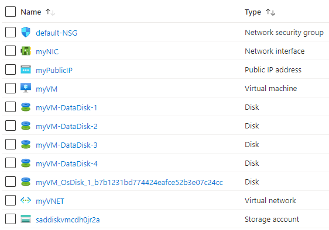

101-vm-multiple-data-disk
===
Create a Virtual Machine from a Windows Image with 4 Empty Data Disks
---

## Description

This is an Azure quickstart sample PowerShell script based on ARM template [101-vm-multiple-data-disk](https://github.com/Azure/azure-quickstart-templates/tree/master/101-vm-multiple-data-disk) from the repository [azure\azure-quickstart-templates](https://github.com/Azure/azure-quickstart-templates).

This script allows you to create a Windows Virtual Machine from a specified image during the template deployment and install the VM Diagnostics Extension. It also attaches 4 empty data disks. Note that you can specify the size of each of the empty data disks. This script also deploys a Storage Account, Virtual Network, Public IP addresses and a Network Interface, and it will deploy the following resources...



... and in-addition to it, just in-case if the deployment is not successful, then it will rollback the entire deployment.

> ### Note: 
> If the specified resource group is already exist then the script will not continue with the deployment.

## Syntax
```
Deploy-AzResource.ps1 [-ResourceGroupName] <string> [-Location] <string> [-VMSize] <string> [-AdminCredential] <pscredential> [-DNSLabelPrefix] <string> [-SizeOfEachDataDiskInGB] <string> [<CommonParameters>]
```

## Example
```powershell
I 💙 PS> $Credential = Get-Credentials

PowerShell credential request
Enter your credentials.
User: sysadmin
Password for user sysadmin: *************

I 💙 PS> $param = @{
>> ResourceGroupName = 'compute-rg'
>> Location = 'westus'
>> VMSize = 'Standard_D3'
>> DNSLabelPrefix = 'myvmsdjkb'
>> SizeOfEachDataDiskInGB = 100
>> AdminCredential = $Credential
>> }

I 💙 PS> .\Deploy-AzResources.ps1 @param
```

## Output
```
Deployment is successful!
```

> Azure Cloud Shell comes with Azure PowerShell pre-installed and you can deploy the above resources using Cloud Shell as well.
>
>[](https://shell.azure.com)

Thank you.
